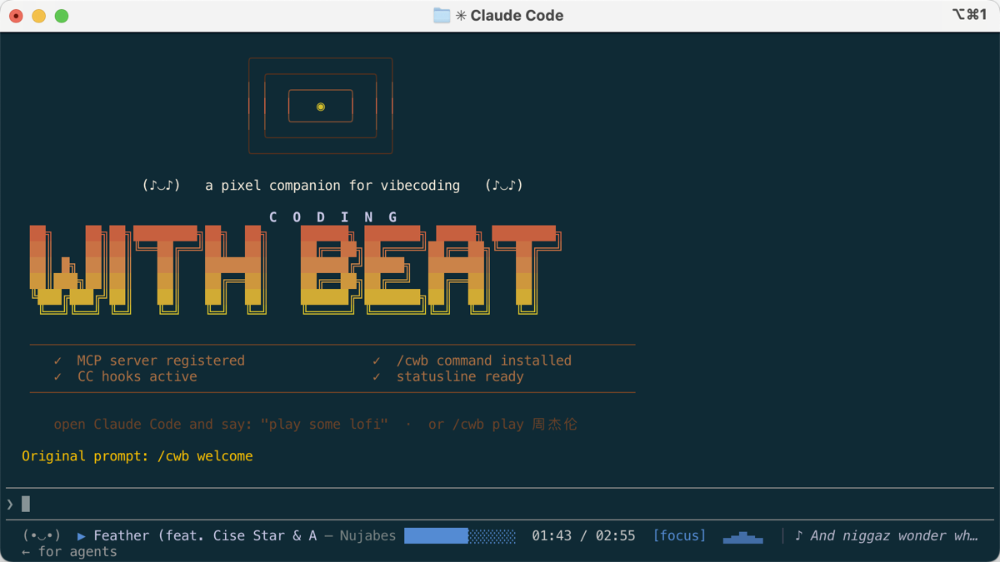
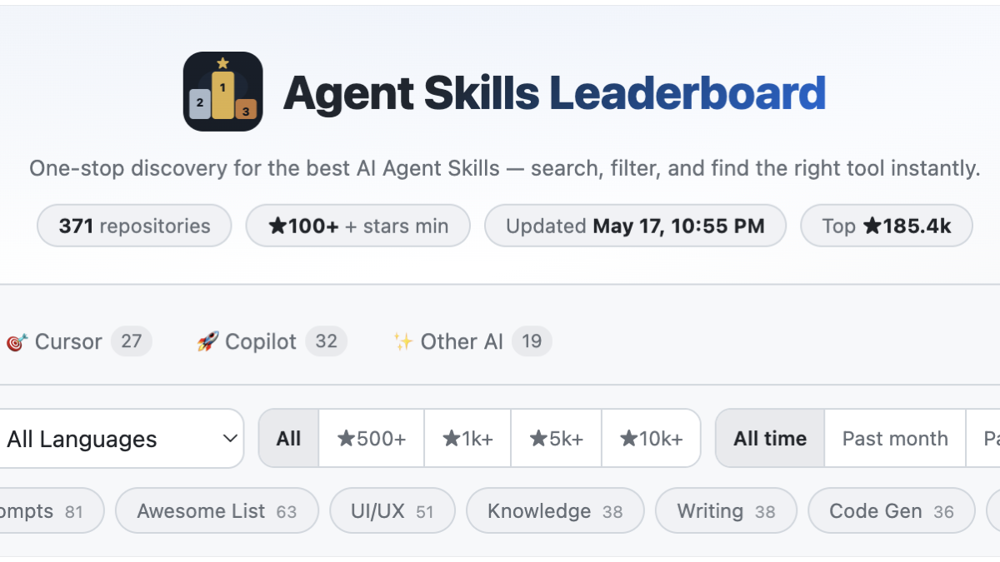
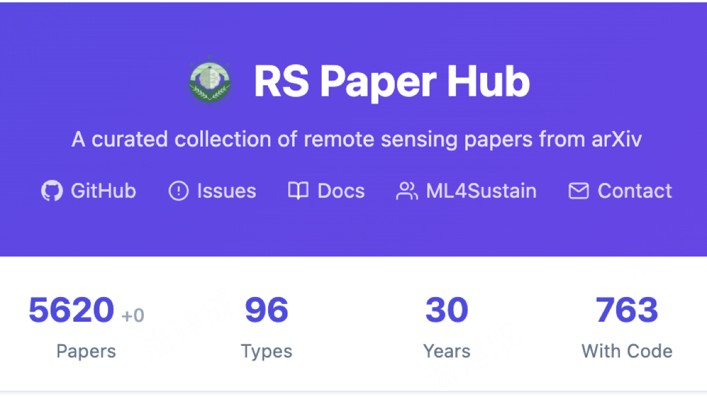
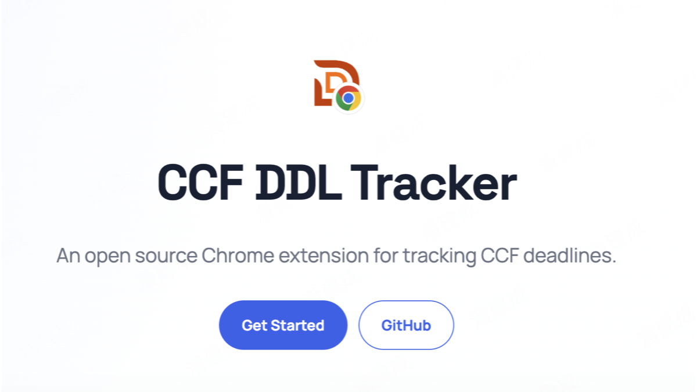
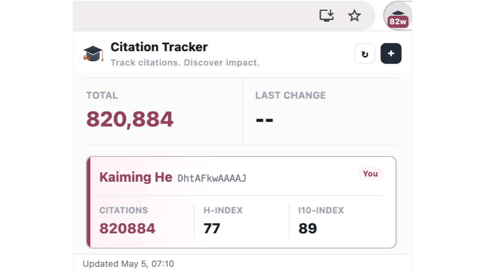

<h1 align="center">CodeBeatAI</h1>

  <b>『码上律动』起来</b> · 想做一些有意思的事情 · 寻找有共同想法的小伙伴加入

  Building playful, useful tools around coding flow, AI agents, open research, and browser-side productivity.

  <a href="https://codebeat.top/">Coding with Beat</a>
  ·
  <a href="https://github.com/CodeBeatAI">GitHub Organization</a>
  ·
  <a href="https://jianchengpan.space/">Homepage</a>

---

## Flagship Project

<table>
  <tr>
    <td width="45%">
      
    </td>
    <td width="55%">
      <h2>
        
        Coding with Beat（码上律动）
      </h2>
      

        A pixel-art DJ companion that lives inside Claude Code — plays music,
        shows lyrics, and reacts to your coding vibes.
      

      

        <a href="https://codebeat.top/"><b>Website</b></a>
        ·
        <a href="https://github.com/jaychempan/coding-with-beat"><b>Source Code</b></a>
      

    </td>
  </tr>
</table>

## What We're Building

<table>
  <tr>
    <td width="50%" valign="top">
      
    </td>
    <td width="50%" valign="top">
      
    </td>
  </tr>
  <tr>
    <td width="50%" valign="top">
      <h3>
        
        Agent Leaderboard（Agent 排行榜）
      </h3>
    </td>
    <td width="50%" valign="top">
      <h3>
        
        RS Paper Hub（遥感论文社）
      </h3>
    </td>
  </tr>
  <tr>
    <td width="50%" valign="top" height="72">
      
Leaderboard for the AI agent ecosystem — Skills, MCP, Prompts, Frameworks & Research.

    </td>
    <td width="50%" valign="top" height="72">
      
An open-source platform that helps the remote sensing and earth observation community stay on top of the latest research.

    </td>
  </tr>
  <tr>
    <td width="50%" valign="top">
      

        <a href="https://agentskills.media/">Website</a>
        ·
        <a href="https://github.com/jaychempan/Agent-Leaderboard">Code</a>
      

    </td>
    <td width="50%" valign="top">
      

        <a href="https://rspaper.top/">Website</a>
        ·
        <a href="https://github.com/ML4Sustain/rs-paper-hub">Code</a>
      

    </td>
  </tr>
  <tr>
    <td width="50%" valign="top">
      
    </td>
    <td width="50%" valign="top">
      
    </td>
  </tr>
  <tr>
    <td width="50%" valign="top">
      <h3>
        
        CCF DDL Tracker
      </h3>
    </td>
    <td width="50%" valign="top">
      <h3>
        
        Citation Tracker
      </h3>
    </td>
  </tr>
  <tr>
    <td width="50%" valign="top" height="56">
      
A lightweight Chrome extension for tracking CCF conference deadlines.

    </td>
    <td width="50%" valign="top" height="56">
      
A lightweight Chrome extension for tracking citations.

    </td>
  </tr>
  <tr>
    <td width="50%" valign="top">
      

        <a href="https://jianchengpan.space/ccf-ddl-tracker/">Website</a>
        ·
        <a href="https://github.com/jaychempan/ccf-ddl-tracker">Code</a>
      

    </td>
    <td width="50%" valign="top">
      

        <a href="https://jianchengpan.space/citation-tracker/">Website</a>
        ·
        <a href="https://github.com/jaychempan/citation-tracker">Code</a>
      

    </td>
  </tr>
</table>

## Project Index

| Project | What it is | Website | Code |
| --- | --- | --- | --- |
| Coding with Beat | Pixel-art DJ companion for Claude Code | [codebeat.top](https://codebeat.top/) | [GitHub](https://github.com/jaychempan/coding-with-beat) |
| Agent Leaderboard | AI agent ecosystem leaderboard | [agentskills.media](https://agentskills.media/) | [GitHub](https://github.com/jaychempan/Agent-Leaderboard) |
| RS Paper Hub | Remote sensing and earth observation paper hub | [rspaper.top](https://rspaper.top/) | [GitHub](https://github.com/ML4Sustain/rs-paper-hub) |
| CCF DDL Tracker | Chrome extension for CCF deadlines | [Project page](https://jianchengpan.space/ccf-ddl-tracker/) | [GitHub](https://github.com/jaychempan/ccf-ddl-tracker) |
| Citation Tracker | Chrome extension for citation tracking | [Project page](https://jianchengpan.space/citation-tracker/) | [GitHub](https://github.com/jaychempan/citation-tracker) |

---

  CodeBeatAI is an open-ended space for products, prototypes, and research tools that make technical work feel more alive.

